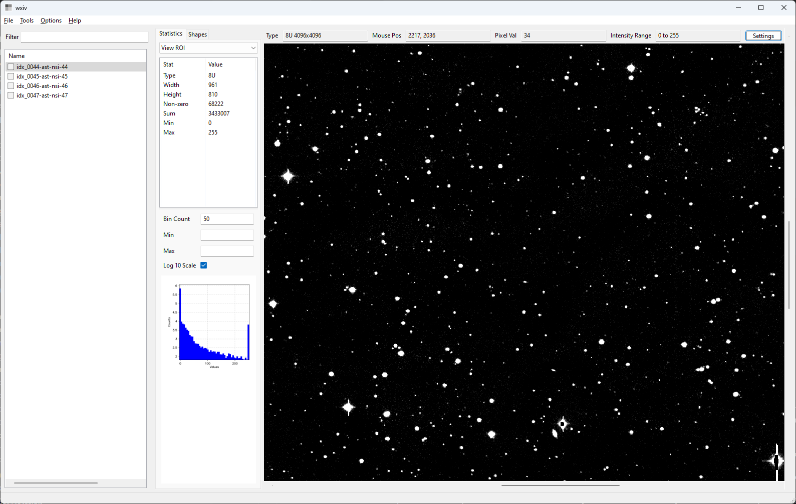
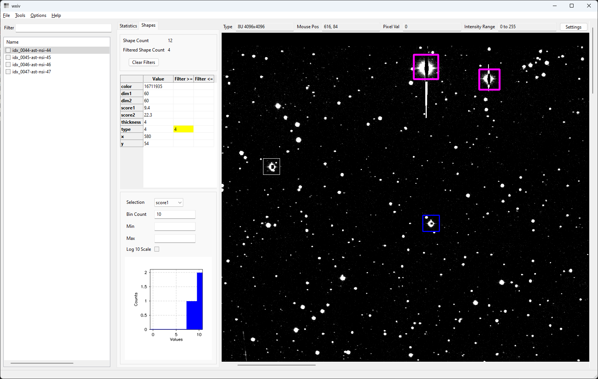

# wxiv
wxiv is a cross-platform (Windows, Linux, Mac) GUI built with C++, WxWidgets, and OpenCV.

wxiv is a developer-focused GUI designed to support a particular image processing workflow where the image processing program saves debug images at various steps during processing and then the developer can step through the set of debug images to inspect the results.





Overview
-----------
I created this as a base so I can fork it and then add project-specific capabilities for each image processing project I work on.

This is intended to support a particular image processing development workflow where in my image processing code I save debug images (into a single directory) after each processing step, then want to view those images and quickly step backwards and forwards through them while maintaining pan and zoom.

This is not intended for processing, editing, or modifying images. I don't think it would ever make sense to try to develop such capabilities within this app, people should just use ImageJ or something else for that. However, in previous implementations I have added view filters (where some image processing operation is done just to view the image) and so that is a possibility here too, but that is not implemented yet.


Supported Platforms
-----------
This has been built, tested, and installed on the following platforms:
- Windows 10
- Windows 11
- Linux (Ubuntu 22.04)
- Mac OS Version 13.1 ("Ventura") on an M2 MacBook Air


Primary Features
-----------
- Directory-oriented interface to quickly step through a sequence of images.
- Very fast image zoom (Ctrl-mousewheel) with large zoom range to see individual pixels.
- Maintain pan and zoom when stepping through images.
- Automatic histogram-based intensity ranging/scaling.
    - Can compute intensity range based on current view or whole image.
- Render shapes on top of the image from an optional neighbor .geo.csv or .parquet file, including colors, line thickness, etc. and arbitrary metadata per shape.
    - This is relatively optimized in order to handle large numbers of shapes.
    - Select which shapes are rendered using metadata values.
- Show shape metadata on mouse-over the rendered shape.
- Show, filter, and histogram shape metadata values.
- Handle multi-page TIF images (though see limitation about non-ASCII paths).
- Toolbar that shows mouse location and pixel value under the mouse cursor.
- Statistics panel with pixel value statistics on whole image, current view, or pixels within a drawn ROI.
- Save multiple views to animated GIF file.


Basic Usage
-----------
The following are some basic usage notes:
- Use `Help -> Help` menu item to view help text.
- You can open an image or a directory containing images via the `File -> Open File` or `File -> Open Dir` menu items.
- wxiv has a list panel with all the images in the dir. You can click image names with the mouse or use `File -> Next image` or `File -> Previous image` menu items (or their shortcuts `Alt-right` and `Alt-left`).
- wxiv renders a view of the current image in the right panel.
- You can zoom in or out (around the current mouse location) via `Ctrl-mousewheel` and later zoom to fit via `Tools -> Fit view` or shortcut `Ctrl-Shift-F`.
- Note that there is a Settings button in the image view panel toolbar to modify intensity auto-ranging parameters.


Directory-Oriented Design
----------------------------------
wxiv is directory-focused, meaning the UI is designed around the scenario of looking at all of the images in a single directory. When you open a single image file, wxiv does not just open that file, it also lists the images that are in its directory. Once the directory is listed, you can step through images with File -> Next and File -> Previous menu items or associated keyboard shortcuts. (Of course wxiv does not load an image until it is selected, for performance reasons.)


Shapes
----------------------------------
wxiv can load and render shapes that go with an image, including arbitrary metadata per shape. wxiv looks for a .geo.csv or .parquet neighbor file for each image, for example foo.tif and foo.geo.csv. wxiv loads and parses the neighbor file and then can render the shapes on the image. wxiv shows the metadata associated with each shape on mouse-over, and can filter and histogram shape metadata values.



The csv parse is not tolerant of incomplete rows (rows with different numbers of columns) and wxiv will fail the load and pop an error dialog in that case.

The neighbor shape file must be tabular and can be either csv or parquet format with these fields:
```
type      required    integer     shape type, see below
x         required    float       location of the shape, in pixels
y         required    float       location of the shape, in pixels
dim1      required    float       usually the dimension (size) of the shape, where meaning is type-dependent
dim2      optional    float       usually a second dimension (size) for a shape, where meaning is type-dependent
thickness optional    integer     line thickness to render the shape, and note that -1 means filled per OpenCV convention
color     optional    integer/str color for rendering, and note that hex is supported, e.g 0xFF00FF or #86fad8
```

In addition to the above columns, wxiv parses and displays any other columns that are present.

The supported shape types (and their integer types) are:
- Point (1)
- Circle (2)
- LineSegment (3)
- Rect (4)

The dim1 field is required even for Point because wxiv renders points as crosses in some cases because single pixels are usually hard to see. For LineSegment dim1, dim2 are not sizes but rather the coordinates of the second point that define the segment.

The header row is required and strings must match exactly. Here is an example:
```
    type,x,y,dim1,dim2,color,thickness,score1,score2
    1,300,300,10,,,1,1.123,3.4
    1,360,300,20,,128,3,2.2,3.5
    1,400,300,30,,0xFF0000,5,2.5,2.3
    2,198.2,80.8,20,,,,1.2,1.4
    2,218.2,80.8,30,,0x00FFFF,4,0.7,0
    2,280.2,80.8,40,,0x00FF00,6,0.8,0.1
    3,330,520,400,200,0x00FF00,6,0.9,0.8
    3,370,550,430,700,0xFF00FF,3,0,0.3
    4,321.435,370.574,40,40,0xFFFFFF,,10.3,20.1
    4,421.435,370.574,40,40,0x0000FF,2,10.5,20.5
    4,821.4,570.5,60,60,0xFF00FF,4,11.4,22.3`
```

The score1 and score2 fields are arbitrary metadata that are not required and that wxiv does not directly use, but does include in the shapes metadata table, filtering, and histogramming capability.

Colors can also be specified as hex like `#86fad8` or `0xFF00FF`.


Design Notes
-----------
Async/multi-threaded implementations are nicer and more usable. However there is significant cost in code complexity. To me, in this case, the cost of async/MT outweighs the benefit. Note that this is intended for image processing developers who are likely to be aware when they are loading a large file, or a file over a slow network connection, and to be understanding of the non-async behavior.


Dependencies/Credits
-----------
The build floats with the latest version of these dependencies except for cv-plot (see note below). I plan to float with latest until it becomes a problem. Here are the dependencies:
- WxWidgets (https://github.com/wxWidgets/wxWidgets)
- OpenCV (https://github.com/opencv/opencv)
- Apache Arrow/Parquet (https://arrow.apache.org/)
- fmt (https://github.com/fmtlib/fmt)
- cv-plot (https://github.com/Profactor/cv-plot) (this is pinned to my fork that adds bar plot capability)
- debugbreak (https://github.com/scottt/debugbreak)


# Development


Building
------------------
The build is cmake-based but is not entirely self-bootstrapping because it uses vcpkg. So you have to do some other setup steps, and then build by running a build script rather than just a default cmake build. See below.

### Warnings
Warnings are made fatal in the Release build in the top CMakeCommon.txt file, and warnings are turned up to some degree but not to the highest levels.

### CMake fetch (github clone without prompt)
The build needs to be able to git clone from github without prompting because it uses cmake fetch to get a couple dependencies. So git needs to be installed, and things need to be set up so that the build can access github repos without prompting.

To test that you can clone without getting prompted:
- `ssh -T git@github.com`
- The above should work without prompting and print something like `Hi <username>! You've successfully authenticated, but GitHub does not provide shell access.`

### Windows (Visual Studio) github git clone Without Prompt
- See: https://interworks.com/blog/2021/09/15/setting-up-ssh-agent-in-windows-for-passwordless-git-authentication/
- you need an ssh key that works for github (probably in your ~/.ssh dir).
    - VS won't prompt for password so some kind of credential management needs to be available.
    - git for windows installs it but it doesn't work for the primary case (ssh key) unless an ssh agent is running. To get an ssh running run this in an elevated powershell:
    - `Get-Service ssh-agent | Set-Service -StartupType Automatic -PassThru | Start-Service`
    and then reboot
- then add the ssh key via:
    - `ssh-add <path to private key>`
- configure git to work with ssh:
    - `git config --global core.sshCommand C:/Windows/System32/OpenSSH/ssh.exe`

### Windows Build
- Clone (from github) and bootstrap vcpkg (by their instructions) somewhere on your machine.
- Set WXIV_VCPKG_ROOT env var to point to your vcpkg repo clone
    - (I had two clones of vcpkg and needed to differentiate so not just using VCPKG_ROOT)
    - WXIV_VCPKG_ROOT is referenced in the CMakeSettings.json file.
    - The setup-vcpkg.bat script will
- See top CMakeLists.txt comments about NSIS install in order to get setup to build installer, which didn't work for me with default NSIS installation.

### Linux Build
- sudo ./scripts/setup-build-machine.sh
    - (after inspecting it to make sure it will not cause any problem for you)
- set VCPKG_ROOT env var to point to a new dir or to an existing vcpkg repo clone
- ./setup-vcpkg.sh
    - This will clone, bootstrap, and build vcpkg packages.
    - The build-all.sh script (below) also calls this, but this does a lot of stuff and you might want to run it separately first.
- ./build-all.sh
    - This also runs ./test.sh


Installers
-----------
See build-installer.* scripts to build installers for Windows, Linux, and Mac OS.


Non-ASCII String Support
-----------
wxWidgets has good non-ASCII string support. Things are not perfectly smooth for standard C++ between platforms because on linux non-ASCII characters are handled as 8-bit utf-8 encoded, not wstring. So you cannot use wxString.ToStdWstring() on a string that has non-ascii characters.
So on Windows wstring works fine, but not on Linux. Thus the strategy I've chosen is to stay with wxWidgets classes (wxString, wxFileName, wxDir, etc) as much as possible.

The filesystem handling in Apache Arrow handles utf-8 std::string on both Windows and Linux, e.g. std::string(s.mb_str(wxConvUTF8)) works on both platforms.


Limitations
-----------
Image paths with non-ASCII characters are handled differently than paths without them. In the non-ASCII case multi-page TIFs are not handled.


Versioning
-----------
This has a bumpversion config file so you can use bumpversion to increment the version number. It just replaces the prior version string with new version string by text replace in the file(s) specified in the config file:
    pip install bumpversion
    bumpversion patch


Future Features
------------------------
Here are some possible future features in approximately the order I might work on them:
- Add quads to list of supported shapes in neighbor shape metadata files (use dim1, dim2 as the second point, then four more columns for p3x,p3y and p4x,p4y).
    - Or a json format instead, which seems better in some ways than adding overloaded columns to the table format.
- Add simple directory browsing (probably just show dirs in list panel, double-click to nav to them, and an Up button to go up a dir).
- Better support for the myriad file formats. Could at least try to deal with the known universe of image extensions and handle failures well.


Contributions
------------------------
- It would be great to have contributions that are likely to be useful to most other users.
- See above about async/MT implementations, I am not likely to want to take on that complexity.
- See the format* scripts that do code formatting and test-format* (called from test.sh) that check formatting.
